# IMDB_Database_Warehousing_and_Business_Intelligence
## Objective:
The aim of the project is to analyse the movies data from multiple sources such as IMDB MoviesLens, The Numbers and BoxOffice Mojo.com based on movies/cast/box office revenues, movie brands and franchises and perform ETL processes using Talend &amp; Alteryx.

## Description:
* Designed Multi Star schema with 10 Fact &amp; 33 Dimension tables &amp; developed Data Integration Pipeline by ETL workflow to load all tables (380M+ rows) from   multiple sources such as CSV, MySQL, MSSQL &amp; PostgreSQL by using Talend
* Implemented Data Profiling, Error Handling, Load Statistics, Cleansing and Performance Tuning to address data quality gaps &amp; maintained referential integrity using Alteryx &amp; Talend
* Executed SQL scripts &amp; created interactive visualization dashboards on PowerBI &amp; Tableau for analyzing the data to draw better insights on sales &amp; customer segmentation

## The key topic areas are:
* Data Architecture
* Dimensional Data Modeling
* Data Integration &amp; ETL (Extract, Transform &amp; Load)
* Data Engineering &amp; Data Preparation
* Business Intelligence &amp; Data Analytics Design

```
Tools Used:
Talend, Alteryx, SQL Server, MySQL, PostreSQL, PowerBI, Tableau, ER Studio
```
> **Instructor:** Rick Sherman

> **Reference Book:** Business Intelligence Guidebook: From Data Integration to Analytics 


## Dataset Links:
https://datasets.imdbws.com/

https://www.boxofficemojo.com/franchise/?ref_=bo_nb_fr_secondarytab

https://www.boxofficemojo.com/brand/?ref_=bo_nb_frs_secondarytab

https://grouplens.org/datasets/movielens/25m/

https://www.the-numbers.com/movies/franchises

https://www.the-numbers.com/movies/franchise/Marvel-Cinematic-Universe#tab=summary

https://www.the-numbers.com/movie/Avengers-The-(2012)#tab=box-office

## References:
https://elearning.tableau.com/

https://help.talend.com/reader/KxVIhxtXBBFymmkkWJ~O4Q/8RlpZdAdKhP0IaMHXRV7yw

https://www.talend.com/

https://grouplens.org/datasets/movielens/
<br/><br/>
### **Talend Jobs:**
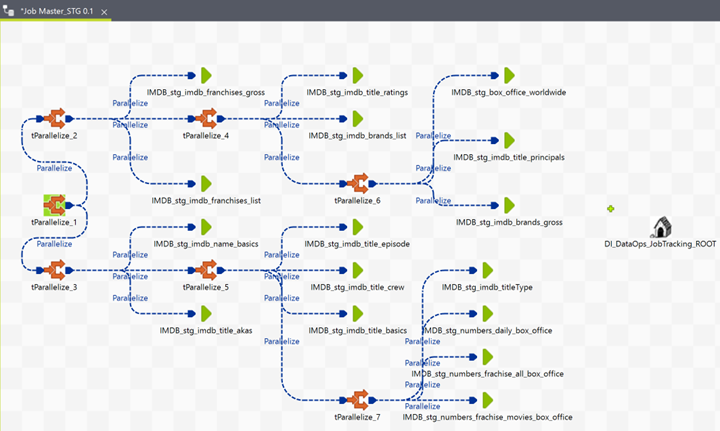
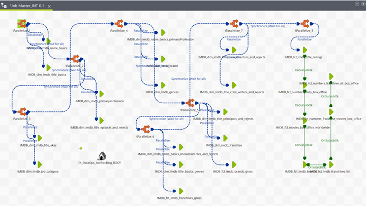
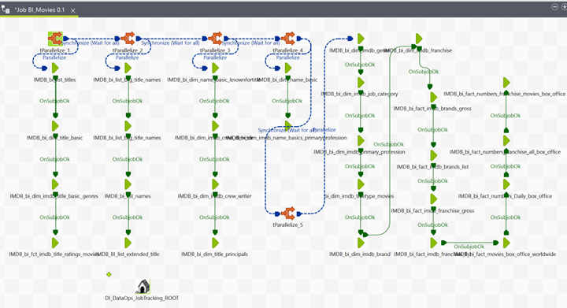
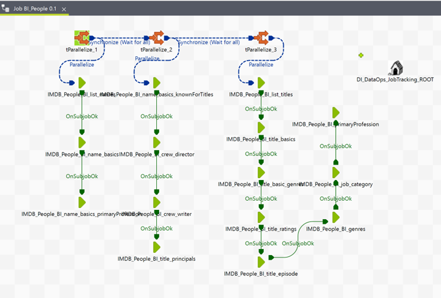
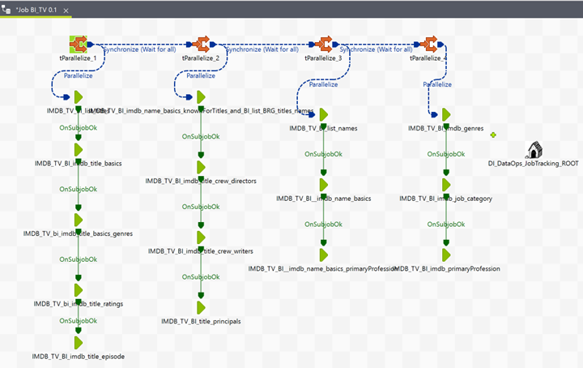
<br/><br/>
### **IMDB_Staging - SQL Server:**
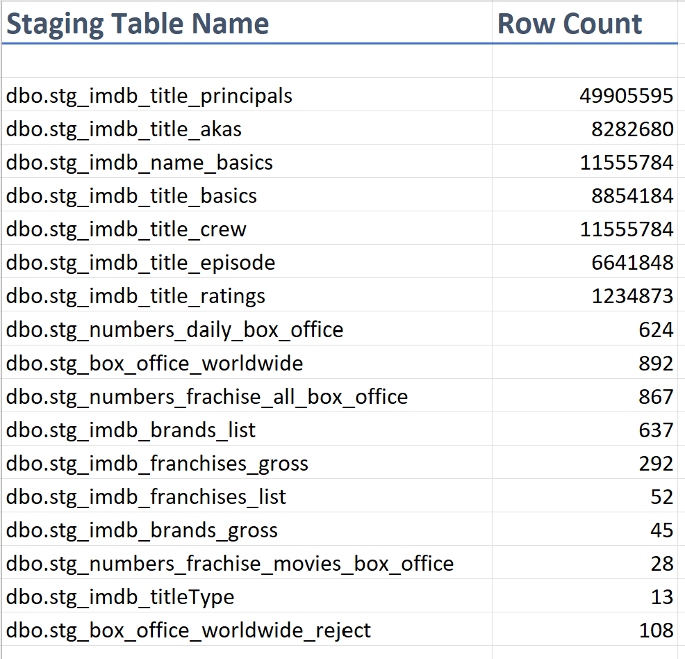
### **IMDB_Integration - SQL Server:**
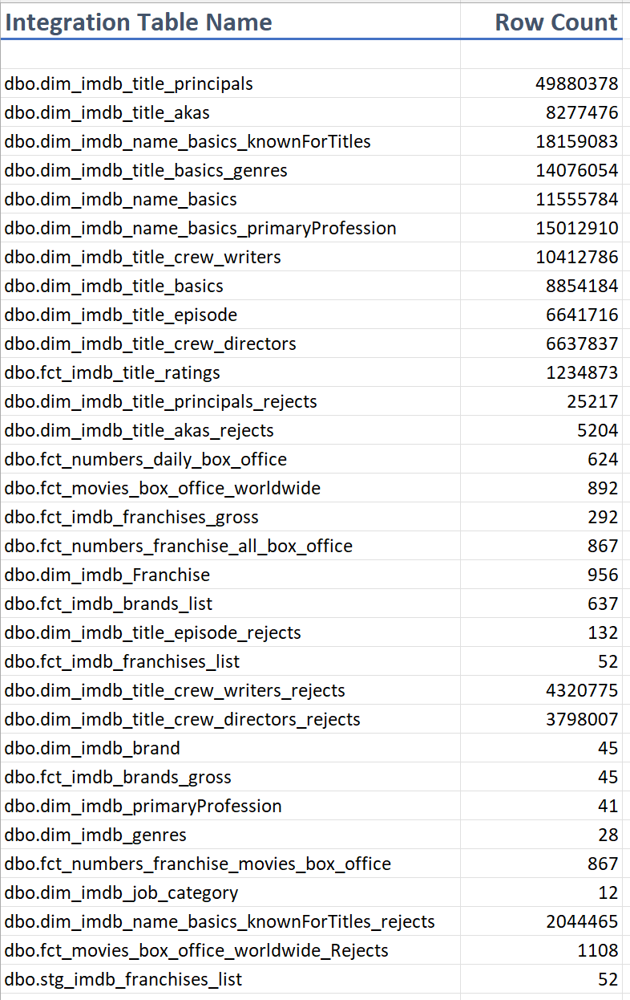
### **IMDB_BI_Movies - SQL Server:**
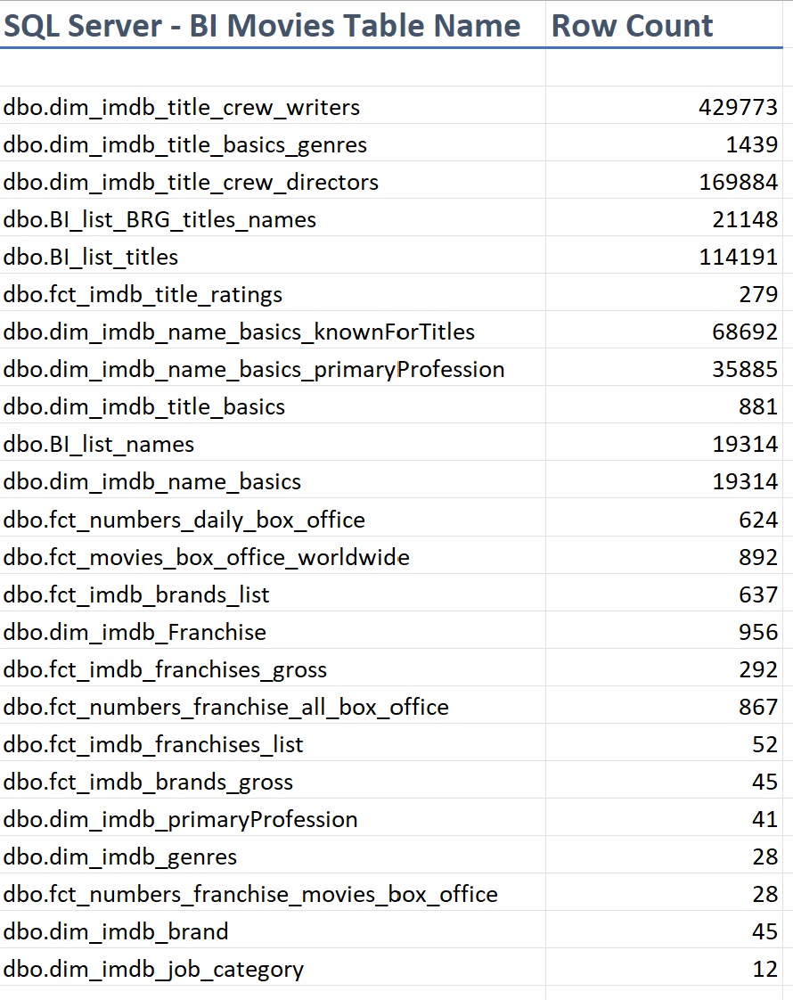
### **IMDB_BI_People - PostgreSQL:**
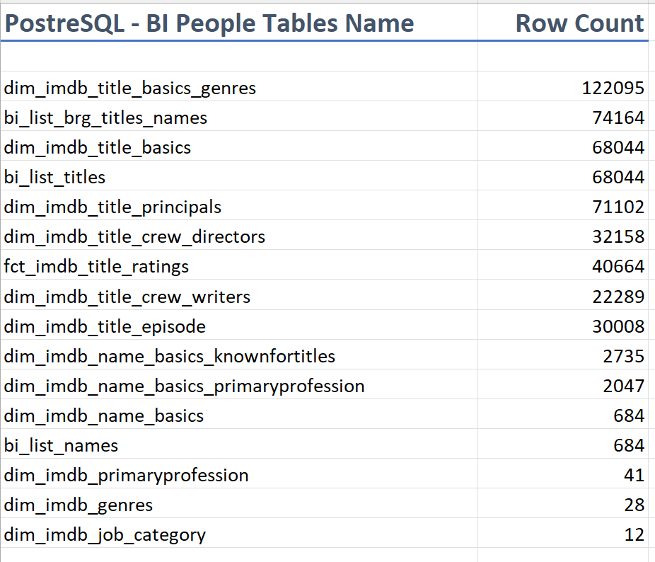
### **IMDB_BI_TV - MySQL:**
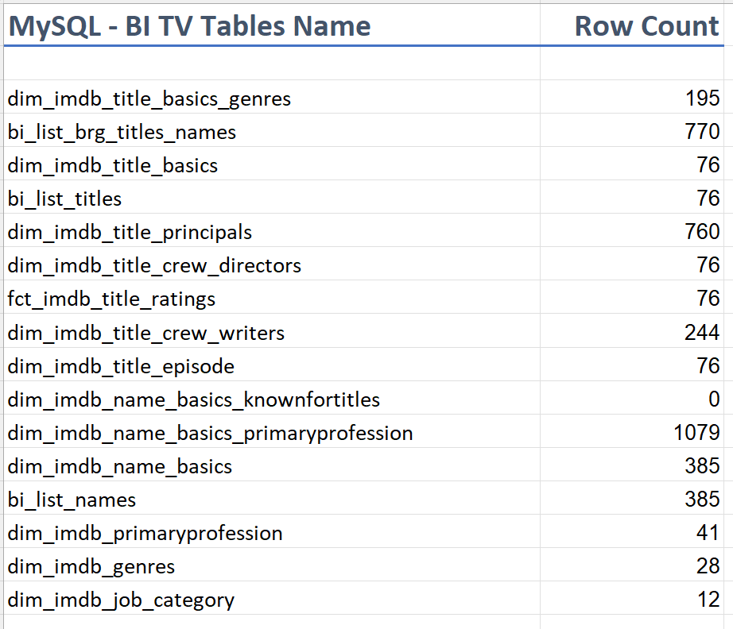
<br/><br/>
### **Alteryx Workflows:**
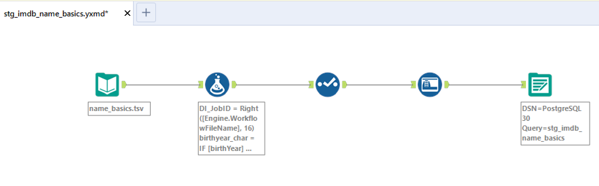
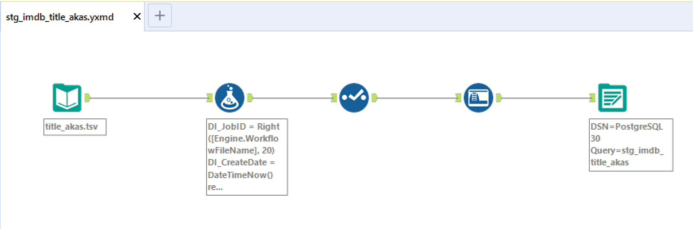
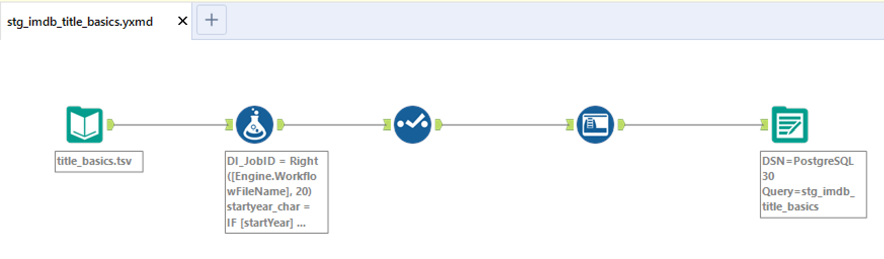


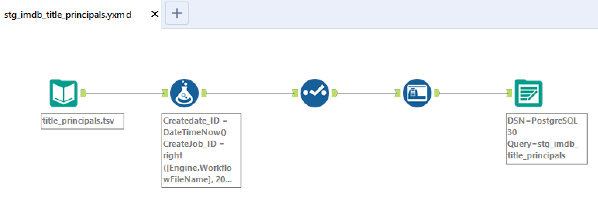
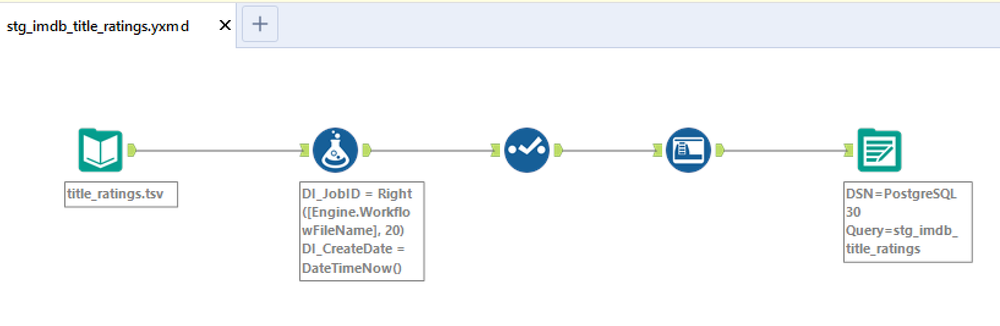
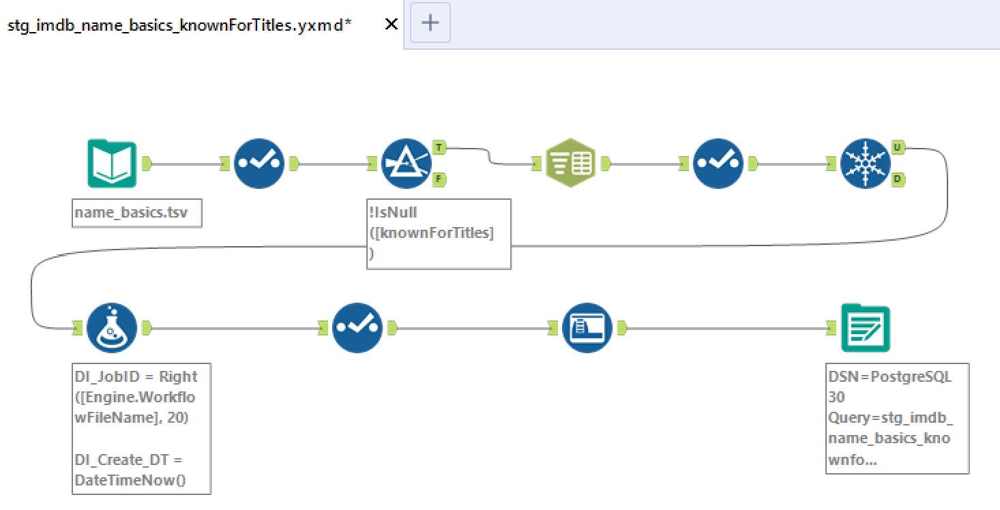
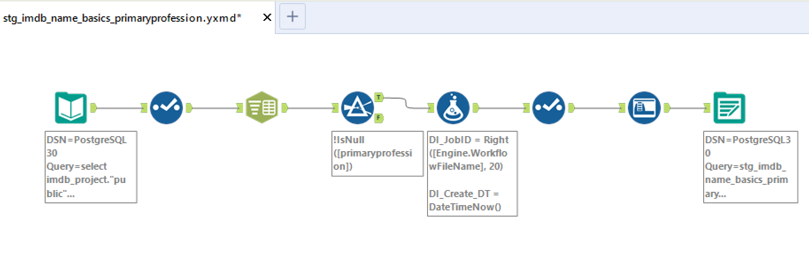
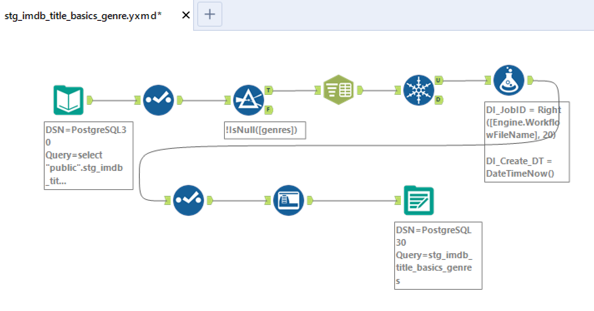
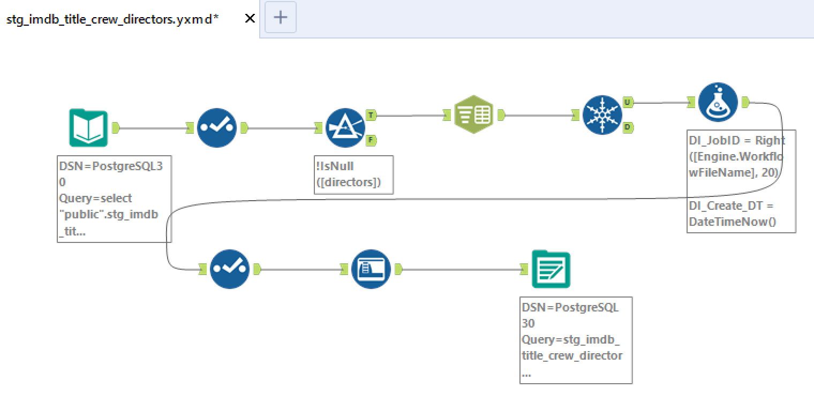
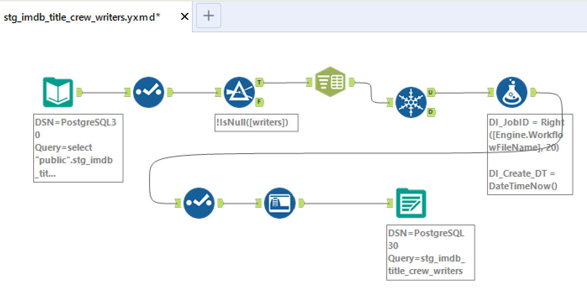
<br/><br/>
### **IMDB_PostgreSQL:**
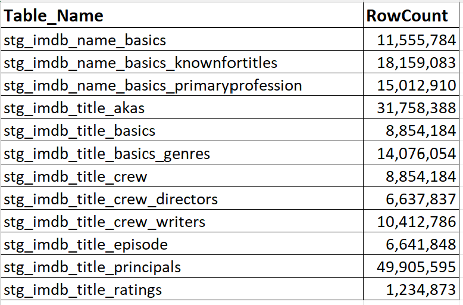