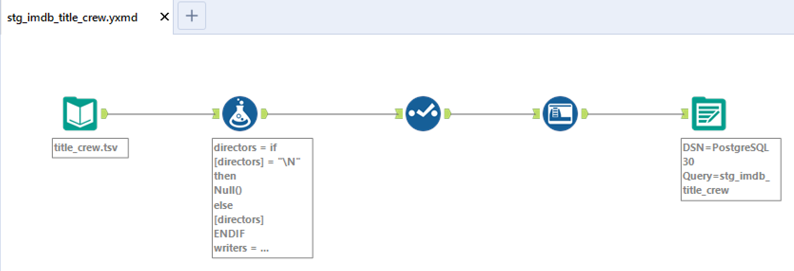
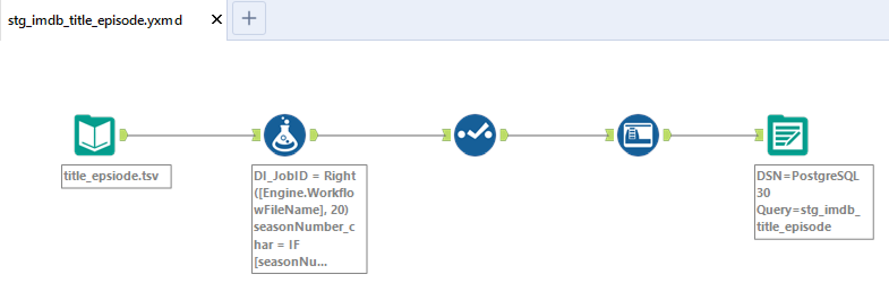

# IMDB_Database_Warehousing_and_Business_Intelligence
### **Description:**
* Adopted Star &amp; Snowflake schemas to design an Enterprise Data Warehouse (EDW) by dimensional data modeling.
* Performed data profiling &amp; cleansing using Alteryx to address data quality gaps &amp; inconsistency.
* Applied data integration by ETL creation using Alteryx &amp; Talend for migrating data from ERP system to EDW.
* Designed visualization reports &amp; built interactive dashboards on PowerBI &amp; Tableau for analyzing the data to draw better insights for business questions.

### **The key topic areas are:**
* Data Architecture
* Dimensional Data Modeling
* Data Integration &amp; ETL (Extract, Transform &amp; Load)
* Data Engineering &amp; Data Preparation
* BI &amp; Data Analytics Design

```
Tools Used:
Talend, Alteryx, SQL Server, MySQL, PostreSQL, PowerBI, Tableau, ER Studio
```
> **Instructor:** Rick Sherman

> **Reference Book:** Business Intelligence Guidebook: From Data Integration to Analytics

<br/><br/>
### **Alteryx Workflows:**






<br/><br/>
### **IMDB_RowCount_PostgreSQL:**
